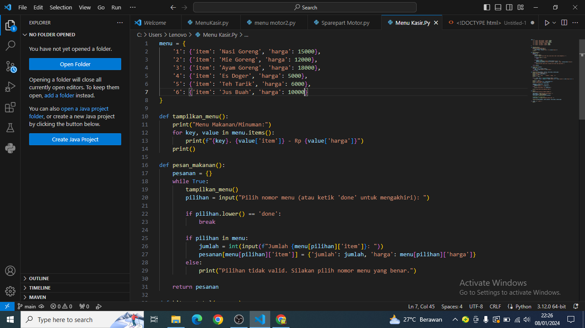
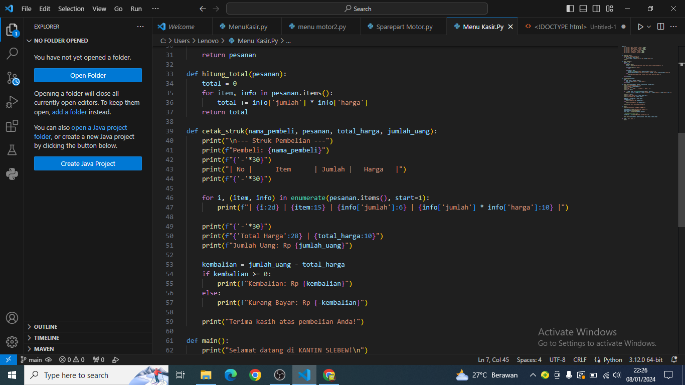
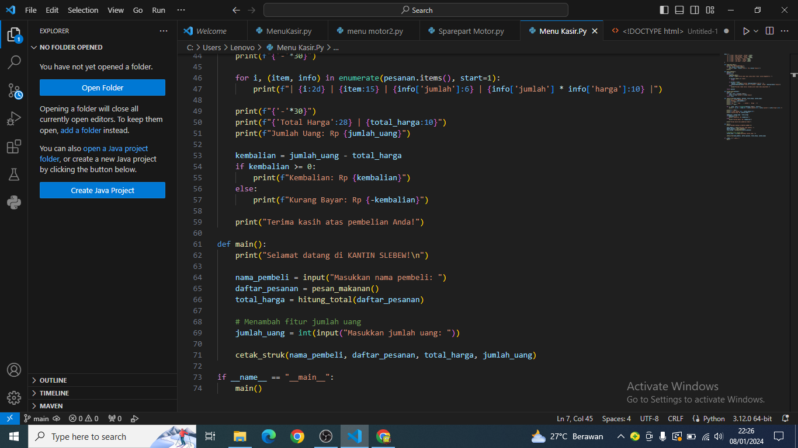
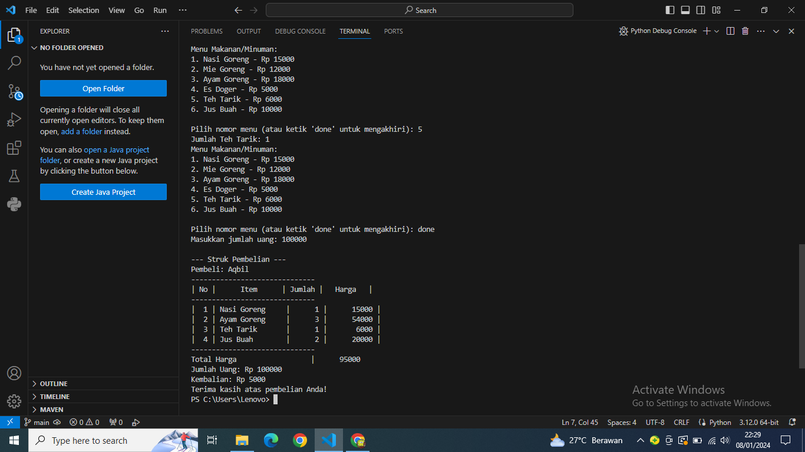

# soaluas

PENJELASAN.

*Menu Makanan/Minuman:

-Program akan menampilkan menu makanan/minuman beserta harga-harganya.

-Dalam contoh ini, menu diwakili oleh sebuah dictionary dengan nomor urut sebagai kunci ('1', '2', dst.), dan setiap item menu memiliki informasi mengenai nama item dan harganya.

*Fungsi tampilkan_menu():

-Digunakan untuk menampilkan menu makanan/minuman ke layar.

*Fungsi pesan_makanan():

-Meminta input dari pengguna untuk memesan makanan/minuman.

-Pengguna dapat memilih nomor menu atau mengetik 'selesai' untuk mengakhiri pemesanan.

-Pesanan disimpan dalam bentuk dictionary dengan nama makanan sebagai kunci dan jumlah serta harga sebagai nilai.

*Fungsi hitung_total(pesanan):

-Menghitung total harga pesanan berdasarkan jumlah dan harga masing-masing item.

-Fungsi cetak_struk(nama_pembeli, pesanan, total_harga, jumlah_uang):

-Mencetak struk pembelian yang berisi informasi tentang nama pembeli, detail pesanan, total harga, jumlah uang yang dibayarkan, dan kembalian atau kurang bayar.

*Fungsi main():

-Menjalankan program utama.

-Meminta nama pembeli, menerima pesanan makanan/minuman, menghitung total harga, meminta jumlah uang yang dibayarkan, dan mencetak struk pembelian.

CODE.

menu = {
    '1': {'item': 'Nasi Goreng', 'harga': 15000},
    '2': {'item': 'Mie Goreng', 'harga': 12000},
    '3': {'item': 'Ayam Goreng', 'harga': 18000},
    '4': {'item': 'Es Doger', 'harga': 5000},
    '5': {'item': 'Teh Tarik', 'harga': 6000},
    '6': {'item': 'Jus Buah', 'harga': 10000}
}

def tampilkan_menu():
    print("Menu Makanan/Minuman:")
    for key, value in menu.items():
        print(f"{key}. {value['item']} - Rp {value['harga']}")
    print()

def pesan_makanan():
    pesanan = {}
    while True:
        tampilkan_menu()
        pilihan = input("Pilih nomor menu (atau ketik 'done' untuk mengakhiri): ")
        
        if pilihan.lower() == 'done':
            break
        
        if pilihan in menu:
            jumlah = int(input(f"Jumlah {menu[pilihan]['item']}: "))
            pesanan[menu[pilihan]['item']] = {'jumlah': jumlah, 'harga': menu[pilihan]['harga']}
        else:
            print("Pilihan tidak valid. Silakan pilih nomor menu yang benar.")

    return pesanan

def hitung_total(pesanan):
    total = 0
    for item, info in pesanan.items():
        total += info['jumlah'] * info['harga']
    return total

def cetak_struk(nama_pembeli, pesanan, total_harga, jumlah_uang):
    print("\n--- Struk Pembelian ---")
    print(f"Pembeli: {nama_pembeli}")
    print(f"{'-'*30}")
    print("| No |      Item      | Jumlah |   Harga   |")
    print(f"{'-'*30}")
    
    for i, (item, info) in enumerate(pesanan.items(), start=1):
        print(f"| {i:2d} | {item:15} | {info['jumlah']:6} | {info['jumlah'] * info['harga']:10} |")
    
    print(f"{'-'*30}")
    print(f"{'Total Harga':28} | {total_harga:10}")
    print(f"Jumlah Uang: Rp {jumlah_uang}")
    
    kembalian = jumlah_uang - total_harga
    if kembalian >= 0:
        print(f"Kembalian: Rp {kembalian}")
    else:
        print(f"Kurang Bayar: Rp {-kembalian}")
    
    print("Terima kasih atas pembelian Anda!")

def main():
    print("Selamat datang di KANTIN SLEBEW!\n")

    nama_pembeli = input("Masukkan nama pembeli: ")
    daftar_pesanan = pesan_makanan()
    total_harga = hitung_total(daftar_pesanan)
    
    # Menambah fitur jumlah uang
    jumlah_uang = int(input("Masukkan jumlah uang: "))
    
    cetak_struk(nama_pembeli, daftar_pesanan, total_harga, jumlah_uang)

if __name__ == "__main__":
    main()
